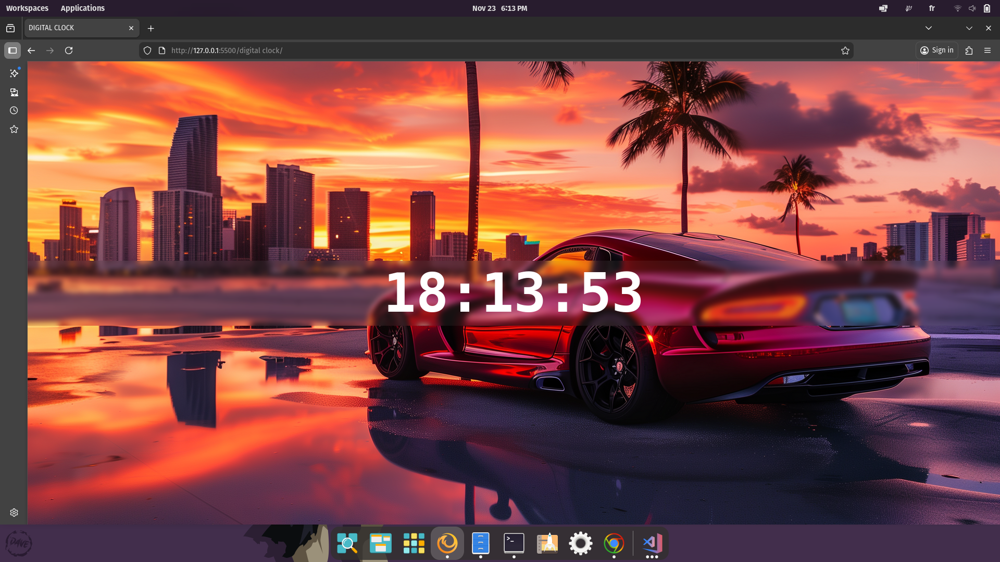

# Digital Clock

Welcome to **Digital Clock** — a live clock demo with time-based backgrounds.

## 🚀 Project Overview
This project displays the current local time, updates every second, and changes the background image according to the time of day (morning, evening, night).

## 🌐 Live Demo
[View Demo](https://issamsensi.github.io/digital-clock/)

## 🌟 Features
- Live HH:MM:SS clock
- Background changes based on current hour (morning/evening/night)
- Uses CSS background images for easy theming

## 🛠️ Technologies Used
- Frontend: HTML, CSS, JavaScript

## 📦 Project Structure
```
index.html      # Main demo page
main.js         # Clock logic and background switch
style.css       # Styles
```

## 📸 Screenshots


## ✨ How to Use
1. Open `index.html` in your browser.
2. The clock updates automatically; background images should be included in this folder (morning.png, evening.png, night.png).

## 👤 Author
**ISSAM SENSI**

---
© 2025 [issamsensi](https://github.com/issamsensi)
